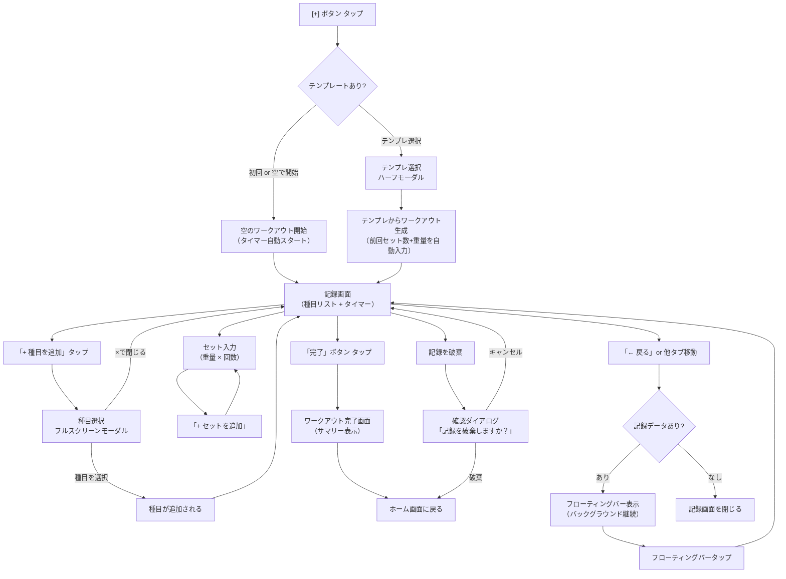

# Workout+ 画面遷移フロー設計提案書

> **タスク**: #4 画面遷移フローの設計
> **作成日**: 2026-02-17
> **ステータス**: 提案（レビュー待ち）

---

## 1. タブ構成の比較と推奨

### 候補比較

| 評価軸 | A案: 5タブ（AI含む） | B案: 4タブ + 設定 | C案: 4タブ（AI格下げ） |
|---|---|---|---|
| **タブ構成** | ホーム / カレンダー / [+] / 統計 / AI | ホーム / カレンダー / [+] / 統計 / 設定 | ホーム / カレンダー / [+] / 統計 |
| **設定の入口** | ホーム右上アバター | タブ直接 | ホーム右上アバター |
| **AIの入口** | タブ直接 | ホーム内リンク or 設定内 | ホーム内カード or FABメニュー |
| **MVPとの整合** | AI は Should（MVP外） | 設定は Must（バックアップ等） | シンプル、4タブで余白あり |
| **タブ数** | 5（+中央ボタン=実質5） | 5（+中央ボタン=実質5） | 4（+中央ボタン=実質4） |
| **将来拡張性** | AI枠が既に確保済み | AI追加時にタブ再編が必要 | AI追加時にタブ追加可能 |
| **ジムでの使いやすさ** | 良い（AIにすぐアクセス） | 普通（設定は頻度低い） | 最も簡潔 |
| **推奨度** | ★★★★☆ | ★★☆☆☆ | ★★★★★ |

### 推奨: C案（4タブ + AIはホーム内リンク）

**理由:**

1. **MVPスコープとの整合**: AI機能（US16, US17）はShould。MVPに不要な機能にタブ枠を占有させるのは過剰
2. **引き算のデザイン原則**: 4タブの方がシンプルで、ジムで素早く操作しやすい
3. **設定の導線**: ホーム右上のアバターアイコンから設定画面へプッシュ遷移。これはiOS/Android共にスタンダードなパターン
4. **AI導線**: ホーム画面のクイック統計エリア下部にカードリンクを配置。将来Proプラン導入時にタブ昇格も容易
5. **将来拡張**: AI機能が成熟した段階で5タブに拡張可能。逆にMVPから5タブにすると、Should機能が中途半端な状態で目立つ位置に出てしまう

**タブ配置（推奨）:**

```
[ ホーム ]  [ カレンダー ]  [ + ]  [ 統計 ]  [ 設定 ]
                             ↑
                        中央フローティングボタン
```

**補足**: 設定はMVP Must（バックアップUS11、タイマー設定US04）を含むため、アクセス頻度を考慮してB案のようにタブに入れる選択肢もある。ただし、設定は「毎回使う」ものではないため、ホーム右上アバターからのプッシュ遷移で十分と判断。最終的にはC案（4タブ）を推奨するが、設定アクセスの頻度次第でB案への変更も検討余地あり。

---

## 2. 記録フロー

### フローチャート



### 記録フローの詳細仕様

#### 2.1 記録開始

| 項目 | 仕様 |
|---|---|
| 起動方法 | タブバー中央の [+] ボタン |
| テンプレ選択 | ハーフモーダル（ボトムシート50%）で最近のテンプレートを表示。「空で開始」オプションを最上部に配置 |
| タイマー | ワークアウト開始と同時に経過時間のカウントを自動スタート |
| セット数の初期値 | 前回ワークアウトのセット数に合わせる（決定済み） |
| 重量/回数の初期値 | 前回記録をプレースホルダーで表示（決定済み） |

#### 2.2 記録中の他タブ移動

| 項目 | 仕様 |
|---|---|
| 移動可否 | 可能（バックグラウンド継続） |
| 状態保持 | 入力済みデータはメモリ上で保持。同時にSQLiteにドラフト保存 |
| ステータス表示 | 全タブ共通のフローティングバー（タブバーの直上に表示） |
| フローティングバーの内容 | 「記録中: 胸・三頭 00:42:15」（種目名と経過時間） |
| タップ動作 | フローティングバータップで記録画面に復帰 |

#### 2.3 記録破棄

| 項目 | 仕様 |
|---|---|
| 導線 | 記録画面ヘッダー左の「← 戻る」ボタンから「記録を破棄」オプション、またはヘッダーの「...」メニュー内 |
| 確認 | 破壊的操作のため、必ず確認ダイアログを表示 |
| ダイアログ | 「ワークアウトを破棄しますか？入力したデータは失われます。」 + 「破棄」「キャンセル」 |

---

## 3. 閲覧フロー

### フローチャート



```mermaid
flowchart TD
    subgraph カレンダー経由
        CA["カレンダー画面"] --> CB["日付タップ"]
        CB --> CC["カレンダー下部に<br/>ワークアウトサマリー表示"]
        CC --> CD["サマリーカード タップ"]
        CD --> CE["ワークアウト詳細画面<br/>（プッシュ遷移）"]
        CE --> CF["「編集」ボタン タップ"]
        CF --> CG["編集モード<br/>（プッシュ遷移）"]
    end

    subgraph ホーム経由
        HA["ホーム画面"] --> HB["「最近のトレーニング」<br/>カード タップ"]
        HB --> HC["ワークアウト詳細画面<br/>（プッシュ遷移）"]
        HC --> HD["「編集」ボタン タップ"]
        HD --> HE["編集モード<br/>（プッシュ遷移）"]
    end

    subgraph 統計経由
        SA["統計画面"] --> SB["種目名 タップ"]
        SB --> SC["種目別履歴<br/>ボトムシート（70%）"]
        SC --> SD["「詳細を見る」タップ"]
        SD --> SE["種目別履歴<br/>フルスクリーン展開"]
    end

    subgraph 記録中の履歴確認
        RA["記録画面"] --> RB["種目名（下線付き）タップ"]
        RB --> RC["種目別履歴<br/>ボトムシート（70%）"]
        RC --> RD["「詳細を見る」タップ"]
        RD --> RE["種目別履歴<br/>フルスクリーン展開"]
    end
```

### 閲覧フローの詳細仕様

#### 3.1 カレンダー → ワークアウト詳細

1. カレンダー画面でトレーニング済みの日付をタップ
2. カレンダー画面の下半分にワークアウトサマリーがスライドイン表示（カレンダー画面内、遷移なし）
3. サマリーカードをタップするとワークアウト詳細画面にプッシュ遷移
4. 詳細画面の「編集」ボタンで編集モードにプッシュ遷移

#### 3.2 ホーム → ワークアウト詳細

1. ホーム画面の「最近のトレーニング」リストからカードをタップ
2. ワークアウト詳細画面にプッシュ遷移
3. 詳細画面の「編集」ボタンで編集モードにプッシュ遷移

#### 3.3 統計 → 種目別履歴

1. 統計画面の種目名やチャート内の種目をタップ
2. 種目別履歴がボトムシート（70%高さ）で表示（決定済み）
3. 「詳細を見る」でフルスクリーンに展開（決定済み）

#### 3.4 記録中 → 種目別履歴

1. 記録画面の種目名（下線付き青文字）をタップ
2. 種目別履歴がボトムシート（70%高さ）で表示
3. 記録画面のコンテキストを維持したまま履歴を参照できる

---

## 4. 全画面の遷移種類マッピング

### 凡例

| 遷移種類 | 説明 | アニメーション |
|---|---|---|
| **タブ切替** | タブバーによる画面切替 | フェード or なし |
| **プッシュ** | ナビゲーションスタックへの追加 | 右からスライドイン |
| **フルスクリーンモーダル** | 画面全体を覆うモーダル | 下からスライドアップ |
| **ハーフモーダル** | 画面下半分を覆うモーダル | 下からスライドアップ |
| **ボトムシート** | 画面の一部を覆うシート | 下からスライドアップ |
| **ダイアログ** | 小さな確認用オーバーレイ | 中央フェードイン |

### 遷移マッピング一覧

| # | 遷移元 | 遷移先 | 遷移種類 | トリガー |
|---|---|---|---|---|
| 1 | 任意のタブ | ホーム | タブ切替 | ホームタブをタップ |
| 2 | 任意のタブ | カレンダー | タブ切替 | カレンダータブをタップ |
| 3 | 任意のタブ | 統計 | タブ切替 | 統計タブをタップ |
| 4 | 任意のタブ | 設定 | タブ切替 | 設定タブをタップ（B案採用時）|
| 5 | 任意のタブ | 記録画面 | フルスクリーンモーダル | [+] ボタンをタップ |
| 6 | [+] ボタン | テンプレ選択 | ハーフモーダル | テンプレが存在する場合に自動表示 |
| 7 | テンプレ選択 | 記録画面 | モーダル→記録画面生成 | テンプレを選択 or 空で開始 |
| 8 | 記録画面 | 種目選択 | フルスクリーンモーダル | 「+ 種目を追加」をタップ |
| 9 | 種目選択 | 記録画面 | モーダル dismiss | 種目を選択 or ×で閉じる |
| 10 | 記録画面 | ワークアウト完了 | プッシュ（置換） | 「完了」ボタンをタップ |
| 11 | ワークアウト完了 | ホーム | プッシュ（全pop） | 「閉じる」or 自動遷移 |
| 12 | 記録画面 | 種目別履歴 | ボトムシート（70%） | 種目名をタップ |
| 13 | 種目別履歴（BS） | 種目別履歴（FS） | フルスクリーン展開 | 「詳細を見る」をタップ |
| 14 | 種目別履歴（FS） | 種目別履歴（BS） | フルスクリーン縮小 | 「← 戻る」をタップ |
| 15 | ホーム | ワークアウト詳細 | プッシュ | 最近のトレーニングカードをタップ |
| 16 | カレンダー | ワークアウト詳細 | プッシュ | 日付サマリーカードをタップ |
| 17 | ワークアウト詳細 | 編集モード | プッシュ | 「編集」ボタンをタップ |
| 18 | ホーム | 設定 | プッシュ | 右上アバターをタップ |
| 19 | 設定 | バックアップ設定 | プッシュ | 「バックアップ」をタップ |
| 20 | 設定 | タイマー設定 | プッシュ | 「デフォルトインターバル」をタップ |
| 21 | 設定 | 単位設定 | プッシュ | 「単位」をタップ |
| 22 | 設定 | 通知設定 | プッシュ | 「通知設定」をタップ |
| 23 | 統計 | 種目別履歴 | ボトムシート（70%） | 種目名・チャート内種目をタップ |
| 24 | ホーム | AIチャット | プッシュ | AIカードリンクをタップ（将来） |
| 25 | 任意の画面 | 記録画面 | フローティングバーからの復帰 | フローティングバーをタップ |
| 26 | 記録画面 | 破棄確認 | ダイアログ | 「記録を破棄」をタップ |
| 27 | ホーム | ペイウォール | フルスクリーンモーダル | Pro誘導バナーをタップ（将来） |

---

## 5. 記録中のグローバルUI提案

### フローティングバー仕様

ワークアウト記録中に他の画面へ移動した場合、画面下部のタブバー直上にフローティングバーを表示する。

```
┌─────────────────────────────────────┐
│                                     │
│         （各タブの画面内容）          │
│                                     │
│                                     │
├─────────────────────────────────────┤  ← フローティングバー
│  ● 記録中  胸・三頭      00:42:15   │
├─────────────────────────────────────┤  ← タブバー
│  🏠    📅    [+]    📊    ⚙️      │
└─────────────────────────────────────┘
```

| 項目 | 仕様 |
|---|---|
| 表示条件 | ワークアウト記録中 かつ 記録画面以外のタブにいるとき |
| 位置 | タブバーの直上（safe area内） |
| 高さ | 44px |
| 背景色 | #0066FF（メインカラー）ベタ塗り |
| テキスト色 | 白 |
| 内容 | 左: ● インジケーター + 「記録中」、中央: ワークアウト名、右: 経過時間 |
| タップ動作 | 記録画面に復帰（フルスクリーンモーダルを再表示） |
| アニメーション | 画面切替時に下からスライドイン |
| 境界線 | 上部に 1px solid rgba(0,0,0,0.1) |

### なぜフローティングバーか

| 候補 | 評価 |
|---|---|
| **フローティングバー（採用）** | タブバーとの親和性が高い。Spotifyのミニプレーヤーと同じパターンで、ユーザーに馴染みがある。記録中であることを常に視認でき、ワンタップで復帰可能 |
| PiP風フローティングウィンドウ | 実装コストが高い。ドラッグ操作で画面要素と干渉するリスク。ワークアウトアプリでは過剰 |
| 通知バッジのみ | 記録中であることに気づきにくい。経過時間が見えない |

---

## 6. 画面一覧とナビゲーション構造

### ナビゲーションスタック構成

```
TabBar
├── ホームタブ (NavigationStack)
│   ├── ホーム画面
│   ├── → ワークアウト詳細 (push)
│   │   └── → 編集モード (push)
│   ├── → 設定 (push)
│   │   ├── → バックアップ設定 (push)
│   │   ├── → タイマー設定 (push)
│   │   ├── → 単位設定 (push)
│   │   └── → 通知設定 (push)
│   └── → AIチャット (push, 将来)
│
├── カレンダータブ (NavigationStack)
│   ├── カレンダー画面
│   └── → ワークアウト詳細 (push)
│       └── → 編集モード (push)
│
├── [+] 中央ボタン (Modal)
│   ├── → テンプレ選択 (half modal)
│   └── → 記録画面 (fullscreen modal)
│       ├── → 種目選択 (fullscreen modal)
│       ├── → 種目別履歴 (bottom sheet → fullscreen)
│       └── → ワークアウト完了 (push replace)
│
├── 統計タブ (NavigationStack)
│   ├── 統計画面
│   └── → 種目別履歴 (bottom sheet → fullscreen)
│
└── 設定タブ (NavigationStack) ※ B案採用時のみ
    ├── 設定画面
    ├── → バックアップ設定 (push)
    ├── → タイマー設定 (push)
    └── → 通知設定 (push)
```

### グローバルオーバーレイ

```
Global Overlays (タブに依存しない)
├── フローティングバー（記録中ステータス）
├── 確認ダイアログ（記録破棄）
└── ペイウォール (fullscreen modal, 将来)
```

---

## 7. 遷移の設計判断まとめ

| 判断ポイント | 決定 | 根拠 |
|---|---|---|
| 記録画面の遷移種類 | フルスクリーンモーダル | タブとは独立した「作業空間」。記録完了またはキャンセルで閉じるモデル。iOSの sheet(fullScreen) に対応 |
| 種目選択の遷移種類 | フルスクリーンモーダル（決定済み） | 300種目のリスト表示にはフルスクリーンの面積が必要 |
| 種目別履歴の遷移種類 | ボトムシート→フルスクリーン（決定済み） | 記録画面のコンテキストを維持しつつ、詳細も見られる段階的開示 |
| ワークアウト詳細の遷移種類 | プッシュ | ホーム/カレンダーのナビスタック上の画面。「← 戻る」で元の一覧に戻れる |
| 設定の遷移種類 | プッシュ | iOS標準パターン。NavigationStack内で階層的に掘る |
| テンプレ選択の遷移種類 | ハーフモーダル | 選択肢が少ない（最近使ったテンプレ数個）ため、フルスクリーンは不要 |
| 記録中の状態表示 | フローティングバー | Spotifyパターン。常時視認可能で、復帰がワンタップ |
